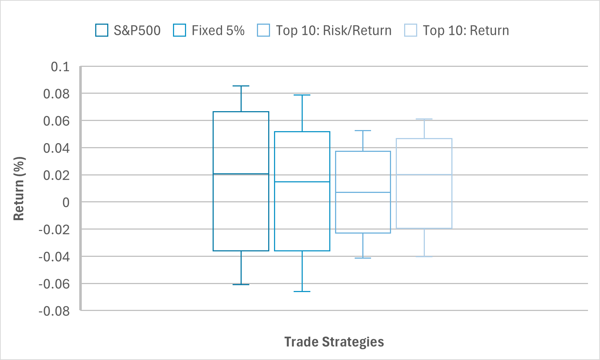
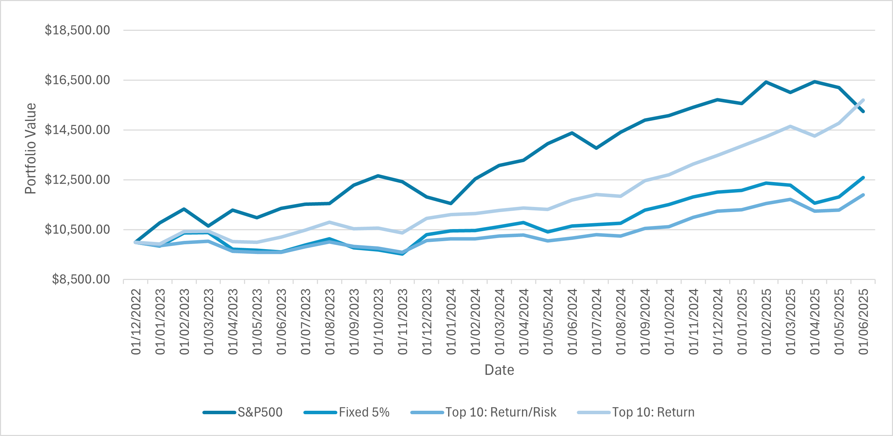

# Using Congressional Trades As A Trade Strategy

## Table of Contents
- [1. Objective](#1.-Objective)
- [2. About the Data](#2.-About-the-Data)
- [3. Methodology](#3.-Methodology)
- [4. Results](#4.-Results)
- [5. Limitations and Improvements](#5.-Limitations-and-Improvements)
- [6. Conclusion](#5.-Conclusion)
- [7. How to Use](#5.-How-to-Use)
- [8. Bibliography](#5.-Bibliography)

## 1. Objective

The objective of this project is to test the hypothesis that using the public trades of Congress members can lead to higher returns compared to the Standard & Poors 500 index (S&P 500). The structure of the project assumes that published trades release insider information held by congress members. Thus, this potential insider information can be used to generate returns greater than the S&P 500 at lower risk.

To test this hypothesis, three strategies have been devised, with their performance compared with the S&P 500.

## 2. About the Data

Records of publicised trades from congress members were taken from the Capitol Trades Website. This data was scraped using the BeautifulSoup library in python, converting the data from a html into a more readable pd.DataFrame format. 

This data was later cleaned, filtering for listed trades under the following criteria:
- Buy trades.
- Trades involving stocks in the S&P 500.
- Trades which were reported at most 30 days after the actual traded date.
- Trades with stock prices listed on Yahoo Finance.
 
Portfolio performance was measured by using stock prices retrieved from the yfinance library in python.

## 3. Methodology

Three trade strategies are backtested within the three year period of September 2022 and August 2025. No trades are conducted within the first three months to allow a buffer for calculations of running mean return and standard deviation per politician.

Strategies are based on following the trades of selected politicians. These politicians are determined by the criteria of the trade strategy. For each day, only trades completed by politicians who meet the criterium of the strategy are opened by buying the corresponding stock with a value worth 5% of the current free cash held.

The strategies tested include:
- All trades
- Trades from traders with top 10 running return/risk
- Trades from traders with top 10 running returns 


## 4. Results

### Table 1: Key Performance Metrics

| |S&P500|Fixed 5%|Top 10: Return/Risk|Top 10: Return| 
|:-:|:-:|:-:|:-:|:-:|
|Mean Excess Return|0.0124|0.00583|0.00374|0.0130|
|Standard Deviation|0.0380|0.0316|0.0218|0.0249|
|Downside Risk|0.0193|0.0228|0.0144|0.0133|
|Interquartile Range|0.0583|0.0311|0.0266|0.0308|
|Sharpe Ratio|0.325|0.185|0.171|0.522|
|Sortino Ratio|0.639|0.255|0.259|0.980|
|Beta|-|0.072|0.023|0.019|
|Alpha|-|0.00876|0.00744|0.0168|

Despite the percieved lower volatility in the "Fixed 5%" and "Top 10: Return/Risk" strategies, evidenced by their lower Standard Deviations and Downside Risk (save "Fixed 5%"), Sharpe and Sortino Ratios for these strategies are lower than the S&P 500. Thus the lower volatility of these strategies do not exceed the losses from the lower returns

The third strategy - "Top 10: Return" - proves to be the best. Its Mean Excess Return exceed the S&P 500, with lower volatility and downside risk. This results in a Sharpe Ratio and Sortino Ratio which greater than that of the S&P 500.

The low Sharpe and Sortino ratio of "Top 10: Return/Risk" is a suprising anomalous result, having these ratios on par with the unfiltered "Fixed 5%". By filtering only the traders with the highest return/risk, it aimed to maximised these performance metrics, however this strategy yielded counter productive results.

Thus, of the three conducted strategies, only "Top 10: Return" bests the performance of the S&P - the returns from the strategy outperforms the index while limiting risk as seen in the greatest Alpha (indicating greater returns for its given risk) and lowest Beta (indicating less exposure to the market systematics risk). Despite this, the other strategies are found to be be less volatile, which may suit the needs of a risk-adverse trader.

### Figure 1: Distribution of Returns



Results find that the three proposed strategies have a range and interquartile-range smaller than that of the S&P 500. This is particularly evident in the two strategies: "Top 10: Risk/Return", "Top 10: Return", while being less prominent in the "Fixed 5%" strategy.
However, Figure 1 indicates lower median % returns from the "Fixed 5%", and "Top 10: Risk/Return", while the "Top 10: Return" exhibits roughly equal median % return as the S&P 500. Likewise to Table 1, Figure 1 concludes that only "Top 10: Return", presents a strategy that may outperform the S&P 500 Index.


### Figure 2: Portfolio Value Over Time



With a starting portfolio value of $10,000, the S&P 500 appreciates vastly quicker than the other models. In spite of this, the growth of the "Top 10: Return" grows to surpass S&P 500 at the end, by a over $1000 by the end of the period.

Furthermore, less extreme fluxuations in the value of the portfolio seen by the "top 10 earning" traders, suggest that the highest earning traders incur less risk than the S&P 500. This is supported by a lower standard deviation and lower Beta comapared to the S&P 500's as well as a higher Sharpe Ratio, suggesting a better return for the amount of risk taken. 

However, the "Fixed 5%" and "Top 10: Risk/Return" strategies severely underperform under the S&P 500, indicating a significant difference in the top 10 politicians by return/risk rate and absolute returns. 

## 5. Limitations and Improvements

- **No transaction fees are incurred**: Actual returns from each strategy will be lower than calculated. The backtest does not include brokering costs, therefore a fixed/percentage cost needs to be included.
- **Only companies with listed price data throughout the whole period were considered**: The backtest does not include trades involving delisted stocks/stocks with missing price data throughout the whole. Therefore, the actual return of the stratagy may vary due to slightly different portfolio composition.
- **Three year limitation**: The data sourced from Capitol Trades is restricted to the trade information released in the past three years. Therefore, there is less training data for the buffer period to identify the current top performing traders.
- **Free held cash does not generate returns**: The simulation involves holding free cash through the period. Actual returns is likely to be higher that calculated if free cash was held in low risk assets. Alternatively, a further refinement to the simulation could be starting with a market-capitalisation weighted portfolio with a value of $10,000, the weights of which would be altered using optimisation through the Black-Litterman model when trades are published.

## 6. Conclusion

Ultimately, results indicate that the original hypothesis, which proposes using the published trades of US Congress is a valid strategy to outperform the S&P 500 index may hold true. Whilst some strategies underperform in regards to monthly returns (which may be even lower than calculated if accounting transaction fees), when compared to the S&P 500, the three concocted strategies may prove to be attractive to risk-adverse traders by offering lower volatility of returns.
As evident from the figures, the "Top 10: Return" strategy consistently outperforms other strategies and even the S&P 500 in regards to portfolio value by the end of the backtest. This could suggest that publicised trades from high performance politicians could be an effective indicator to predict upward stock price movement.

## 7. How to Use

The backtesting program is organised into 6 modules:
- `_1_trade_fetch.py`: Scrapes published stock buy trades from Capitol Trades website and saves to `raw_trades.csv`. Trades are filtered based on aforementioned criteria in **2. About the Data**
- `_2_price_fetch.py`: Fetches price data (September 2022 to August 2025) of all unique tickers from `raw_trades.csv` and the S&P 500.
- `_3_data_merge.py`: Assigns initial and final price for trade data in `raw_trades.csv` and saves to `aggregate_data.csv`.
- `_4_calculation.py`: Assigns trade sizes to trade data in `aggregate_data.csv` according to trade strategy, trade size calculations can be altered for different filtering/percentage trade sizes.
- `_5_simulation.py`: Carries out the back test

### Instructions

To test other trade strategies:
1. Install dependencies: run the following in the terminal. 
    ```
    pip install -r requirements.txt
    ```
2. Adjust trade sizes and trades filtered in the `trade_size` function
3. Run program modules sequentially  

## 8. Bibliography
1. He, Guangliang and He, Guangliang and Litterman, Robert, The Intuition Behind Black-Litterman Model Portfolios. Available at SSRN: https://ssrn.com/abstract=334304 or http://dx.doi.org/10.2139/ssrn.334304
2. [Capitol Trades](https://www.capitoltrades.com/trades) - Historical Congressional Trade Data
3. Yahoo Finance, accessed via `yfinance` python library - Historical Price Data
